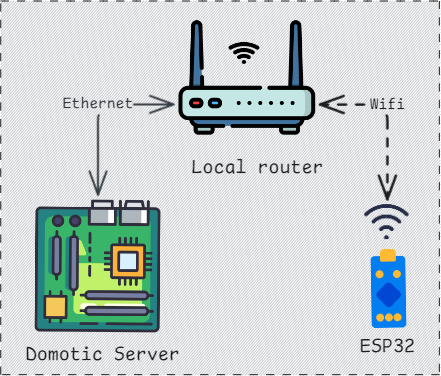
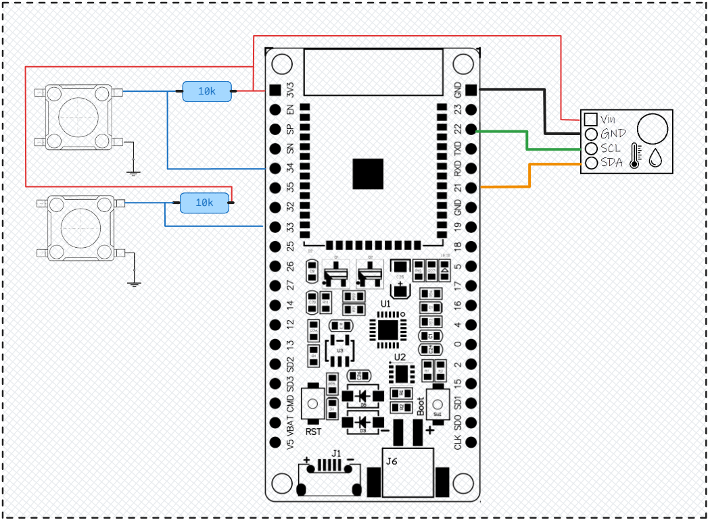

# UDP Sensors

## Introduction

This repository provides the code to create an UDP Temperature and Humidity sensors.
Wifi and UDP parameters (ssid, password, target IP, port and measurments frequency) are configurable through a web interface.

## Motivation

The aim is to create a cheap sensor that can send T° and H% data via UDP within a local network. Then, by using a domotic server, I will be able to read these values and use them through a domotic interface. So there is no stored data, no permanent web interface and no API.
The domotic server can see when a UDP packet is sent on a given port.

### Constraints

To save energy, I have decided not to create a web server that is always on. It is not necessary to measure T° or H% every 30 seconds.
So I decided to use deepsleep between each measurement, with a configurable frequency.
When the sensor wakes up, it sends sensor readings and goes back to sleep.

If the sensors wake up while there is a wifi failure, it will start a power saving loop while re-establishing the wifi connection. See [functional diagram](#functional-diagram) for more details.

## Hardware

### Components list
- Esp32 wroom32
- AHT10 sensor
- 2x buttons
- 2x 10k Ohms resistors

### Wiring 

### Comments

A [pull up wiring](https://learn.sparkfun.com/tutorials/pull-up-resistors/all) is used with resistors :

- _When the button is pressed, the input pin is pulled low. The value of resistor controls how much current you want to flow from VCC, through the button, and then to ground._
- _When the button is not pressed, the input pin is pulled high. The value of the pull-up resistor controls the voltage on the input pin._ 

## Software

### Functional diagram

