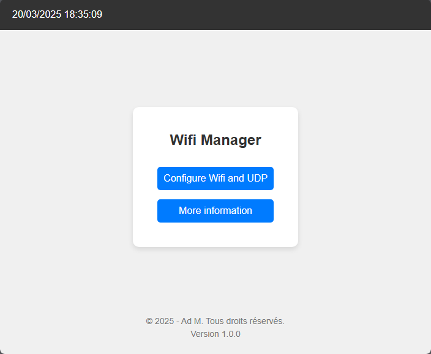
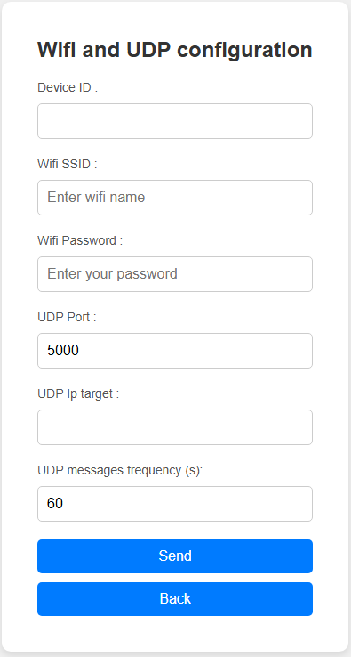

# Access Point mode

Refer to the [functional diagram](../../README.md#functional-diagram) to know in which condition you can run the Access Point mode.

:warning: If there is no activity on the Access Point web pages for **10 minutes**, the ESP32 will enter sleep mode. The only way to return to Access Point mode is to press the Reset button see [functional diagram](../../README.md#functional-diagram). Each time you access a page, the 10 minutes timer will be reset.

## Credentials

When the ESP32 start up in Access Point mode, you should connect to its Wi-Fi network.

Access point values are defined in the [default.cpp file](../../lib/default/default.cpp).

SSID: ESP32 \
Password: 123456789

## Interfaces

Once connected to the access point, you must access the server user interface available on the `192.168.4.1` IP address.

## Index pages

This page will allows you to `Configure Wifi and UDP` or to get `More information`.

  <b>Home page</b>

## Wifi and UDP Configuration

This page will allows you to `Configure Wifi and UDP`. \
Default values are defined in the [default.cpp file](../../lib/default/default.cpp)

Requested information are: 

|   Parameters                  |   Default value   | Constraintes                      | Comments                                          |
|:-----------------------------:|:----------------: |:-------------------               |:--------------------------------------------------|
|     Device ID                 |     404           | Min: 1  Max: 50                |    Added in UDP message to identify the device    |
|     Wifi SSID                 |                   |                                   | Your Wifi SSID                                    |
|     Wifi password             |                   |                                   | Your Wifi password                                |
|     UDP port                  |     5000          | Min: 5000  Max: 65535          | Port use to send UDP message                      |
|     UDP Ip Target             |     192.168.1.255 | IP format only  www.xxx.yyy.zzz| Target Ip on your local network                   |
|     UDP Message frequency     |     1200          | Min: 60  Max: 18000            | T° and H% transmission frequency in seconds       |

 
 

  <b>Wifi and UDP configuration page</b>

When the _Send_ button is pressed, the ESP32 will reboot and try to connect to your wireless network according to your settings. If it cannot connect to the wireless network, it will restart the access point mode. See [functional diagram](../../README.md#functional-diagram).

